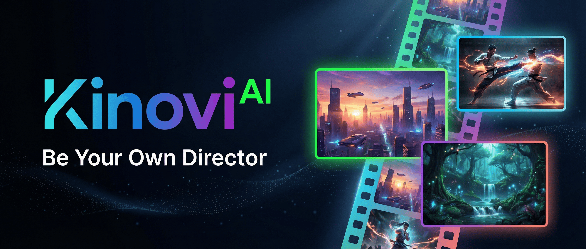

<!-- 
建议将此文件保存为 .github/profile/README.md 
并在开头添加一张高质量的品牌 Banner 图片（替换下方的图片链接）
-->

  
  
   
  
  <h1>🎬 Kinovi — Be Your Own Director</h1>
  
<b>Powered by Seedance 2.0. Say It, Film It.</b>

  

    
    
    
  

---

## ✨ Welcome to the Future of Filmmaking

We believe everyone has a story worth filming. **Kinovi** is a next-generation AI Video Studio built for creators, storytellers, and dreamers. Powered by the revolutionary **Seedance 2.0** model, we are democratizing cinematic video production.

From indie creators to professional studios, we provide the tools to turn your imagination into cinematic reality. No expensive gear, no massive crews—just your vision and our AI.

## 🎨 Creative Capabilities

We give you unprecedented control over AI video generation. Mix and match inputs to direct your scene exactly how you envision it.

### 📝 Text to Video
Transform your scripts and natural language prompts into stunning 4K cinematic shots. Just describe the scene, the lighting, and the camera movement.

### 🖼️ Image to Video
Breathe life into your static art. Upload your images and let Kinovi animate them with hyper-realistic physics and natural motion. Use **First & Last Frame** control to dictate exactly how a shot begins and ends.

### 🎛️ The Ultimate Director's Tool: Omni-Reference Mode
Why rely on just text? With our unique `@` tagging system, you can upload up to **9 images, 3 videos, and 3 audio tracks** in a single generation.
- `@Image1` for character consistency
- `@Video1` to replicate complex camera movements (like a Hitchcock zoom)
- `@Audio1` for perfect rhythm and lip-sync

## 🌟 Why Creators Choose Kinovi

- **Cinematic Quality:** 4K upscale support, hyper-realistic human generation, and stable style maintenance.
- **Perfect Consistency:** Maintain character faces, product details, and scene elements across long sequences.
- **Unmatched Control:** You are the director. Control the exact motion, style, and flow of your video.
- **Lightning Fast:** Generate 5-second cinematic clips in under a minute.

## 🤝 Join the Creator Community

The best part of Kinovi is what **you** build with it. Our community is pushing the boundaries of AI filmmaking every day—from martial arts battle remakes to cinematic short films.

* **Share your creations:** Tag us on [X (Twitter)](https://twitter.com/kinovi_ai) and Instagram.
* **Get inspired:** Join our Discord to share prompts, workflows, and collaborate with other filmmakers.
* **Build with us:** Are you a developer? Check out our [API Documentation](https://kinovi.ai/docs) to integrate Kinovi into your own apps.

---

  <h3>Ready to call action?</h3>
  
Start your journey today with <b>200 free credits</b>.

  

